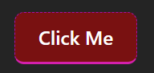

# React Interview Test

## Overview
This test is designed to evaluate your proficiency in React.js, Redux, Material UI, AG Grid, D3.js, styled-components, Jest, and React Testing Library. You will build a small React application that displays a list of items in a grid and includes a bar chart visualization of the data.

## Task
### Requirements:
1. **Data Display**:
   - Use AG Grid to display a list of items (e.g., products with name, price, and quantity).
   - Include sorting and filtering functionality.
   - The sample data is in file: ./data/sample-products.js
   - Include a column to apply a filter for the next step

2. **Data Visualization**:
   - Use D3.js to create a bar chart showing the prices from the sample data over time
   - The sample data is in file: ./data/sample-energy.js

3. **Styling**:
   - Use Material UI for layout and styled-components for custom styling.
   - We require that the Button is styled as such:
   ```    
   border: 1px dashed #aa11aa;
   border-bottom: 2px solid #dd22aa;
   background-color: #cc000088;
   ```
   


4. **State Management**:
   - Use Redux to manage the state of the application:
     - When we are clicking on an item in the AG grid, change the D3 Chart to only show that energy type

5. **Testing**:
   - Write unit tests for the Redux actions and reducers.

### Time Allocation:
- **Setup and Implementation**: 30 minutes
- **Testing**: 15 minutes

## Instructions
1. Clone this repository.
2. Install dependencies using `npm install`.
3. Start the development server using `npm run dev`.
4. Implement the requirements in the `src` folder.
5. Write tests in the `src/__tests__` folder.
6. Submit your code by pushing it to a Git repository or sharing a zip file.

## Evaluation Criteria
- Code quality and organization.
- Proper use of React, Redux, Material UI, AG Grid, and D3.js.
- Styling with Material UI and styled-components.
- Unit and component tests.
- Semantic HTML and responsive design.
